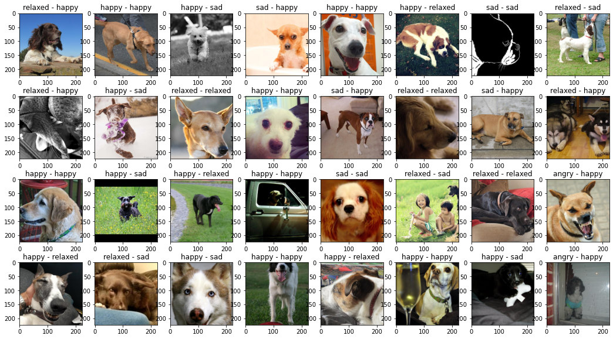
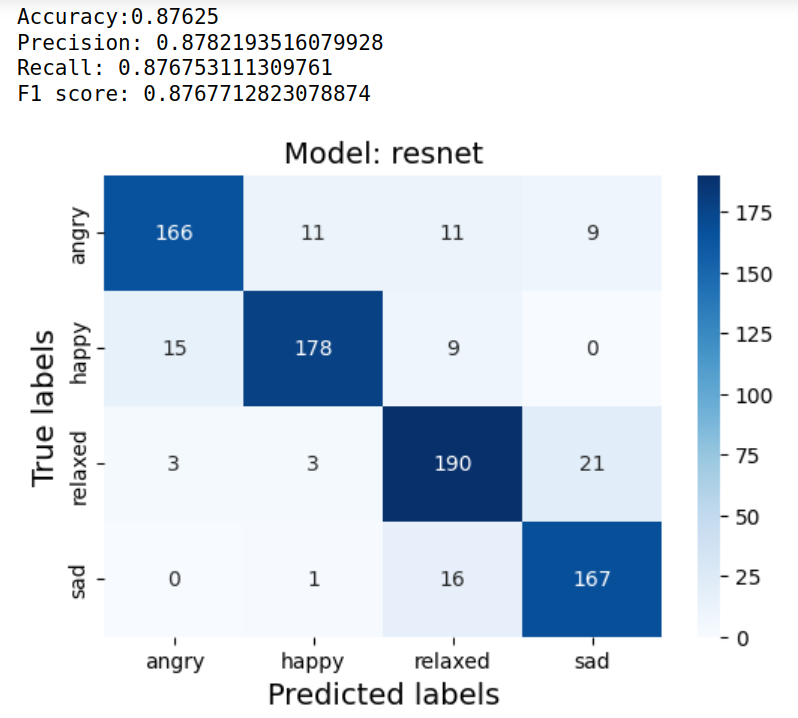
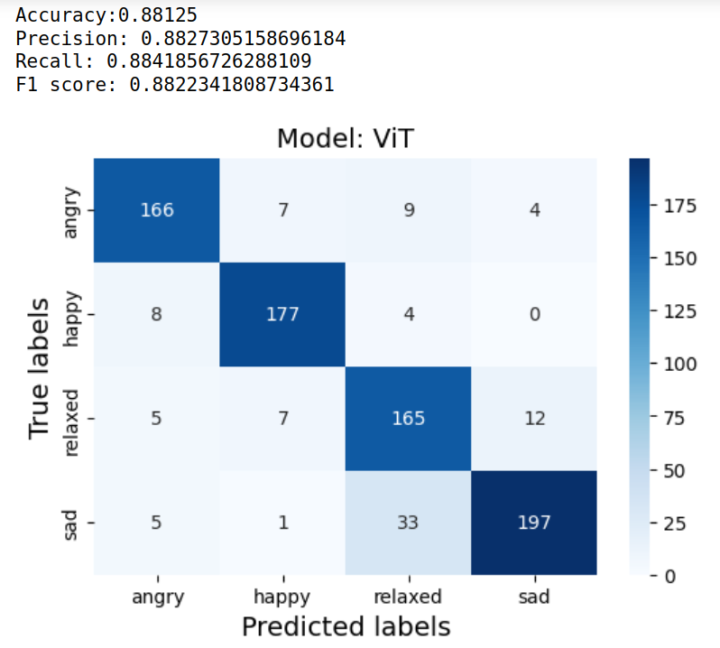

# Dogs Emotions Classifier
- Jupyter notebook with a baseline for dog emotion classification.
- UI version.

## Dataset
- [Dog Emotion Dataset on Kaggle](https://www.kaggle.com/datasets/danielshanbalico/dog-emotion)

- Images with labels:

## Evaluation
- ResNet:

- ViT:

## Announcement
- This is my homework for the "Deep Learning" course.
